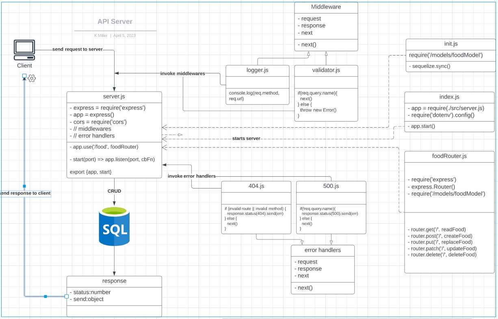

# api-server
Code Fellows - Code 401 - Lab 03

## Server
URL: https://api-server-vjwr.onrender.com

Endpoint: /food

Example: https://api-server-vjwr.onrender.com/food

## UML Architecture

## GitHub Actions

- [Actions](https://github.com/KMArtwork/api-server/actions)

## GitHub PRs

- [All PRs](https://github.com/KMArtwork/api-server/pulls)

### Lab 03
- [PR1 - Complete Lab](https://github.com/KMArtwork/api-server/pull/1)

## Lab 04

- [PR3 - Complete Lab](https://github.com/KMArtwork/api-server/pull/3)

### Partner Review

- **Who was your partner?** Zachariah Jeter
- **What was your key takeaway?** 
  - Code reviewing can be a great way to share ideas with your peers and help deepen both of your understandings of certain concepts. When Person A is able to explain something to the Person B, and Person B fully understands those ideas after the explanation, then both of you have benefited from that process.
- **Share the link to your PR request:** [My PR to Partner's Repo](https://github.com/Zjet95/api-server/pull/2)
- **Share the link to their PR request:** n/a